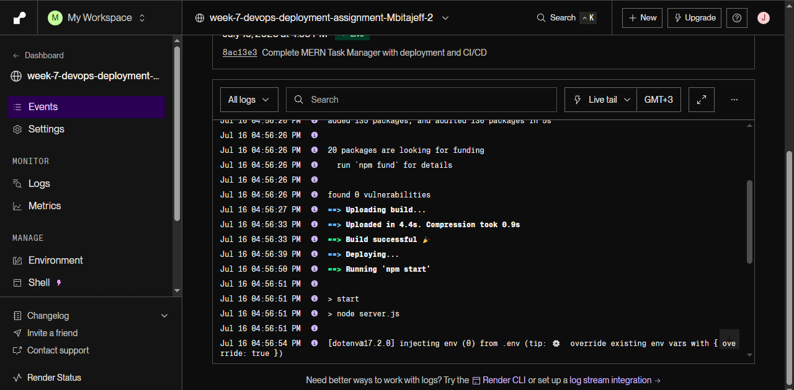
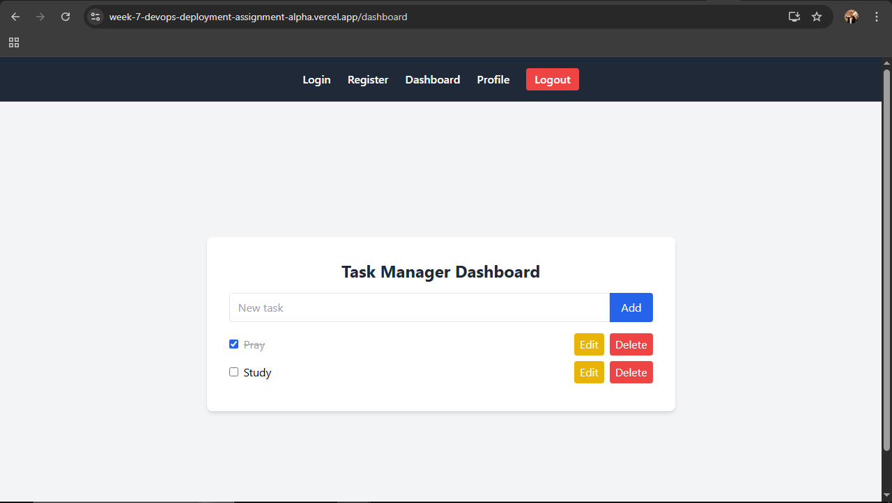

# MERN Task Manager

A full-stack Task Manager application built with MongoDB, Express, React, and Node.js. Includes authentication, task CRUD, user profile, and is ready for production deployment with CI/CD and monitoring.

---

## Features
- User registration and login (JWT authentication)
- Create, read, update, and delete tasks
- Mark tasks as completed
- Edit/delete tasks
- User profile (view/update name, email, password)
- Protected routes (frontend and backend)
- Responsive UI with Tailwind CSS
- Error handling and user feedback
- Ready for deployment to Render (backend) and Vercel (frontend)
- CI/CD with GitHub Actions
- Health check and monitoring endpoints

---

## Folder Structure
```
week-7-devops-deployment-assignment-Mbitajeff/
  client/      # React frontend
  server/      # Express backend
  .github/     # GitHub Actions workflows
  .env.example # Environment variable templates
  README.md    # This file
```

---

## Getting Started

### Prerequisites
- Node.js (v16+ recommended)
- pnpm or npm
- MongoDB Atlas account
- GitHub account

### 1. Clone the Repository
```
git clone https://github.com/Mbitajeff/week-7-devops-deployment-assignment-Mbitajeff.git
cd week-7-devops-deployment-assignment-Mbitajeff
```

### 2. Setup Environment Variables
- Copy `.env.example` to `.env` in both `client/` and `server/` folders.
- Fill in your MongoDB URI and JWT secret in `server/.env`.
- Set `REACT_APP_API_URL` in `client/.env` to your backend URL (e.g., `https://week-7-devops-deployment-assignment-kl6o.onrender.com/api`).

### 3. Install Dependencies
```
cd server
pnpm install
cd ../client
pnpm install
```

### 4. Run Locally
- **Backend:**
  ```
  cd server
  pnpm start
  ```
- **Frontend:**
  ```
  cd client
  pnpm start
  ```
- Visit [http://localhost:3000](http://localhost:3000)

---

## Deployment

### Backend (Render)
- **URL:** https://week-7-devops-deployment-assignment-kl6o.onrender.com/
- See Render dashboard for logs and monitoring.

### Frontend (Vercel)
- **URL:** https://week-7-devops-deployment-assignment-alpha.vercel.app/
- See Vercel dashboard for logs and monitoring.

---

## CI/CD (GitHub Actions)
- Workflows in `.github/workflows/` run tests, lint, and build on push.
- Example files:
  - `frontend-ci.yml` / `backend-ci.yml`: Lint/test/build
- 
- 

---

## Monitoring & Maintenance
- Health check endpoint: `GET /api/health`
- Use UptimeRobot, Render/Vercel monitoring, or similar
- Error tracking: Add Sentry or similar if desired
- Regularly update dependencies and backup your database

---

## Screenshots

### Render Deployment


### Vercel Deployment


---

## Live Demo
- **Frontend:** https://week-7-devops-deployment-assignment-alpha.vercel.app/
- **Backend API:** https://week-7-devops-deployment-assignment-kl6o.onrender.com/

---

## License
MIT 